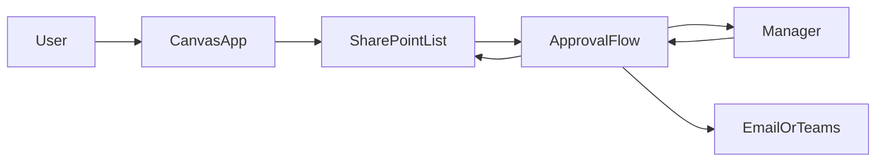

# Overview

This starter project is intentionally small. It teaches the core pattern used in many internal business apps:

## Why this structure

This project uses standard Microsoft tools first because they are easier to learn and support:

- `Power Apps Canvas App` is the front end.
- `SharePoint List` is the first data layer.
- `Power Automate Cloud Flow` handles the approval and notification logic.

This avoids early blockers like custom APIs, gateways, premium connectors, and SAP-specific technical dependencies.

## First release scope

The first release should do only these things:

1. Let a user submit a request.
2. Store that request in SharePoint.
3. Send an approval to a manager.
4. Update the request status to approved or rejected.
5. Notify the requester about the result.

Anything beyond that should wait until this version works reliably.

## Recommended screens

- `scrHome`: simple landing screen with navigation buttons
- `scrSubmitRequest`: form screen for entering a new request
- `scrMyRequests`: gallery screen for showing the user's previous requests

## Recommended flow behavior

- Trigger on new SharePoint item creation
- Start and wait for an approval
- Update the same SharePoint item with the outcome
- Send a final notification to the requester

## Delivery order

1. Confirm environment access and permissions.
2. Create the SharePoint list and columns.
3. Build the flow and prove approvals work.
4. Build the app against that same list.
5. Test the full loop with a real request.
6. Explore `SAP Business One` integration as a separate phase.

## Later phase: SAP Business One

After the first version works, evaluate one of these routes:

- `Power Automate Desktop` if only screen-level access exists
- supported API or service-layer access if IT can provide it
- middleware or a custom connector if direct connectivity is not practical

Do not make the first app depend on SAP until the integration path is confirmed.
