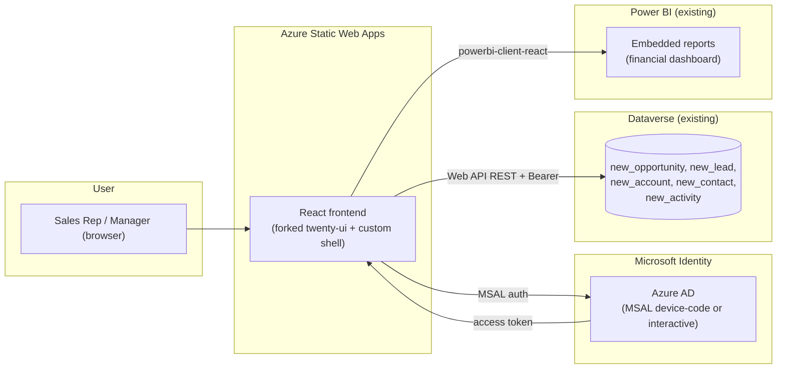

# Frontend Architecture: Twenty-Style CRM on Microsoft Platform

> **Status:** Pivot proposal. Replaces the abandoned Canvas Power App approach.
> **Audience:** Stakeholders, technical leads, anyone evaluating the project direction.
> **Date:** 2026-04-22

## TL;DR

We are pivoting from Canvas Power Apps to a **custom React frontend on Dataverse**.
The Canvas approach was technically functional but cannot deliver Twenty's
look-and-feel without months of fragile work against deprecated tooling
(`pac canvas pack`/`unpack`).

The recommended path is a **selective fork of Twenty** — copy Twenty's UI
primitives package (`twenty-ui`) and design tokens, then build a fresh app
shell on top, swapping Twenty's GraphQL backend for the Dataverse Web API.

| | Canvas Power App | Custom React (this proposal) |
|---|---|---|
| Visual fidelity to Twenty | None without months of PCF work | High — using Twenty's actual UI primitives |
| Auth | Built-in | MSAL (Azure AD) — same tenant as Dataverse |
| Backend | Dataverse (kept) | Dataverse (kept, unchanged) |
| Tooling state | `pac canvas pack` is deprecated | Standard React/Next.js, well-supported |
| Power BI integration | Embed control | `powerbi-client-react` |
| Hosting cost | M365-bundled | ~$0/mo (Azure Static Web Apps free tier) |
| Per-user license | Power Apps premium ($5–20/mo) | None beyond M365 |
| Dev time to MVP | Multi-month, fragile | 4–6 weeks, standard web work |

## Why we pivoted

We spent ~1 week trying to author a Canvas Power App from the terminal so
that it would auto-bind to the Dataverse `Opportunities` table on import.
We hit the following blockers, in order:

1. `pac canvas pack` silently empties `Properties.LocalDatabaseReferences` —
   so re-packed apps lose their Dataverse binding.
2. Re-injecting that field broke the `.msapp` checksum and Studio import.
3. After fixing checksums, we had to reverse-engineer the
   `pkgs/TableDefinitions/<Name>.json` source format from a third-party
   sample (pnp `timesheet-using-dataverse`), since Microsoft does not
   document it.
4. **The whole `pac canvas pack/unpack` toolchain is officially deprecated**
   (every run prints "will be removed in a future release"). Building
   long-term tooling on top of it is not sustainable.
5. Even when v3 finally produced a Studio-acceptable `.msapp` with one
   working data source, the resulting screens look like a Canvas Power App,
   not Twenty. Replicating Twenty's UI on Canvas requires building custom
   PCF (PowerApps Component Framework) controls in React anyway — at which
   point Canvas is just a heavy wrapper around what could be a normal
   React app.

The Canvas approach was the wrong tool for the stated goal.

## Architecture

## Why a *selective* fork instead of a full fork

Twenty's frontend is **571,186 lines of TypeScript across 7,551 files**,
tightly fused to:

- A custom GraphQL schema with metadata-driven entity types
- Apollo Client, Recoil, and a complex `object-metadata` engine
- A NestJS + Postgres backend (`twenty-server`) we cannot use directly

A wholesale fork would require:

- Replacing Apollo + GraphQL with REST/Dataverse calls **everywhere**
  (thousands of call sites)
- Re-implementing or removing `object-metadata` (Twenty's dynamic schema
  engine, which queries its own backend for entity definitions)
- Maintaining a 500K+ LOC fork we don't fully understand
- Realistic effort: **3–6 months full-time for one developer**

A *selective* fork takes a different cut:

| Take from Twenty | Build fresh |
|---|---|
| `twenty-ui` package (~5K LOC of UI primitives) | App shell, routing |
| Design tokens, theme files (`theme-light.css`, `theme-dark.css`) | Data layer (Dataverse REST client) |
| Specific reusable components (sidebar, table cell, kanban card) | Auth flow (MSAL) |
| Visual style, typography, spacing | Entity-specific pages |

This gets us **Twenty's look-and-feel without inheriting Twenty's backend
coupling**. Realistic effort: **4–6 weeks to a deployable MVP**.

## Tech stack

| Layer | Choice | Rationale |
|---|---|---|
| Build / framework | **Vite + React 18** (matching Twenty's setup) | Drop-in compatibility with `twenty-ui` package |
| Routing | **React Router v6** | What Twenty uses; no SSR complexity |
| Styling | **Twenty's CSS theme + Mantine + Emotion** | Twenty already uses Mantine + Emotion — minimum impedance |
| State | **TanStack Query** (server state) + **Zustand** (UI state) | Lighter than Recoil for our needs; no GraphQL = no Apollo |
| Auth | **@azure/msal-react** | Official Microsoft library, supports our M365 tenant |
| Dataverse client | Custom typed wrapper over Web API | Generated TypeScript types from Dataverse `$metadata` |
| Power BI embed | **powerbi-client-react** | Official React wrapper |
| Hosting | **Azure Static Web Apps** (free tier) | Native Azure AD integration, ~$0/mo, automatic CI/CD via GitHub |

We are **not** using Next.js — Twenty doesn't, and SSR adds complexity we
don't need for an internal tool.

## Data model mapping

Dataverse tables we already have or will create, mapped to Twenty's
equivalent entities (so we know which Twenty UI pieces to reuse):

| Dataverse table | Twenty equivalent | Status |
|---|---|---|
| `new_opportunity` | `opportunity` (Twenty's `opportunities` view) | **Done** — table + 10 columns + 2 choice sets created |
| `new_lead` | `lead` | To create |
| `new_account` | `company` | To create |
| `new_contact` | `person` | To create |
| `new_activity` | `task` / `note` | To create |

Tables 2–5 will be created via the same idempotent Python pattern as
`tools/dataverse/create_opportunity.py` — fully terminal-automated.

## Phased delivery

| Phase | Duration | Deliverable | User-visible |
|---|---|---|---|
| **0. Cleanup** | Done | Canvas attempt removed; archive in git history if needed | Repo is clean |
| **1. Foundation** | 1 week | Vite scaffold, MSAL sign-in, Dataverse REST client lib, type generation, `twenty-ui` integrated | Empty app you can sign into; sidebar visible |
| **2. Opportunities CRUD** | 3–5 days | List view (table), detail view, create/edit form for `new_opportunity` | Reps can create/view opportunities; deployed to ASWA |
| **3. Other entities** | 1 week | Lead, Account, Contact, Activity tables created in Dataverse + CRUD pages | Reps have a usable CRM core |
| **4. Twenty-style polish** | 1 week | Kanban view (Opps by stage), filterable views, search, related-records on detail pages, dark mode toggle | Looks and feels like Twenty |
| **5. Manager view** | 3–5 days | Power BI dashboards embedded, role-aware navigation (Manager sees dashboards-first) | Managers see KPIs on login |
| **6. Hardening** | 3–5 days | Error boundaries, loading states, toast notifications, accessibility audit, deploy pipeline | Production-ready |

**Realistic timeline to v1: 4–6 weeks** for one full-time developer.

## Risks

| Risk | Severity | Mitigation |
|---|---|---|
| `twenty-ui` has tight coupling to twenty-front internals we can't easily satisfy | High | Audit the package on day 1; if too coupled, fall back to extracting design tokens + rebuilding components with shadcn/ui (~1 extra week) |
| Twenty's AGPL-3.0 license requires open-sourcing the derivative | High for closed-source, none for internal-only | Internal tools used by employees only **do not** trigger AGPL distribution requirement (no "user interacting with it over a network" outside the company). Confirm with legal if uncertain. Alternative: rebuild with shadcn (MIT-licensed Twenty-inspired components). |
| Dataverse Web API rate limits | Medium | Use TanStack Query caching aggressively; batch reads where possible |
| Azure AD token refresh edge cases | Low | MSAL handles silently; add fallback redirect flow |
| User wants features Twenty has that depend on Twenty's backend (workflows, metadata API, AI pipeline) | Medium | Out of MVP scope; can be added later via Power Automate / Azure Functions |

## Open decisions

1. **AGPL license**: confirm internal-only deployment is acceptable, OR
   commit to publishing the fork's source under AGPL, OR rebuild with
   MIT-licensed shadcn/ui components inspired by Twenty's design.
2. **Auth model**: Azure AD only (employees) vs. also expose to external
   contacts (would require Azure AD B2C, more setup).
3. **Mobile**: ship a responsive web app (covers 90%) or build a separate
   React Native app later.
4. **Multi-tenant**: single tenant (one Dataverse env) for now? If
   multiple environments later, MSAL config needs adjusting.

## What stays from the Canvas attempt

- **Dataverse `new_opportunity` table** + 10 custom columns + 2 choice
  sets — kept, used by the new frontend unchanged.
- **`tools/dataverse/`** Python scripts for table creation/seeding —
  kept, will be extended for Lead/Account/Contact/Activity.
- **Power BI financial report** — kept, will be embedded in the new
  frontend's manager view.
- **Solution `scrCRMDataverse`** in Dataverse — kept.

What was deleted: `canvas-app/` directory, `tools/dataverse/inject_canvas_datasource.py`,
`tools/dataverse/patch_packed_msapp.py`. The Canvas seed `.msapp` files
no longer matter.

## Cost estimate (5–20 users)

| Item | Monthly cost |
|---|---|
| Azure Static Web Apps (free tier) | $0 |
| Dataverse storage (existing dev env) | included in M365 dev plan |
| Power BI Pro (already provisioned) | included in M365 |
| MSAL / Azure AD auth | $0 |
| Domain (optional) | $1–2 |
| **Total recurring** | **~$0–2/month** |

Compare: Power Apps premium licensing for 20 users = $100–400/month.

## Next steps

Once this doc is approved:

1. Confirm the AGPL question with legal (or pick the MIT-rebuild path).
2. Scaffold `crm-frontend/` with Vite + React + MSAL.
3. Audit `twenty-ui` for usability outside Twenty's monorepo.
4. Build phase 1 → deploy to ASWA → iterate.
