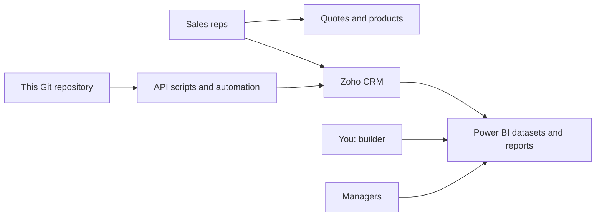

# Architecture: Zoho CRM, Power BI, and this repository

## High-level

- **Zoho CRM** is the system where leads, deals, activities, and quotes are entered and updated day to day.
- **Power BI** is where you publish **read-only** analytics for management (and optionally for reps) using data sourced from Zoho.
- **This repo** stores **documentation**, **automation** (e.g. Python/Node that call Zoho’s API), and **versioned exports** (under `artifacts/`) that you choose to keep. It is *not* a full real-time mirror of the Zoho admin configuration.

## Repository layout (quick)

| Path | Role |
|------|------|
| `docs/zoho/` | Playbooks, checklists, pipeline and quote-line docs |
| `docs/zoho/archive/` | Historical workshop captures (e.g. configuration rounds) |
| `tools/zoho/` | API scripts, `connect_zoho.py`, `pipelines_seed.json` |
| `tools/zoho/archive/` | Retired or rarely used seeds (e.g. alternate pipeline JSON) |
| `artifacts/zoho/` | Non-secret data: import CSVs, picklists, Deluge snippets, product extensions |

`make help` lists common automation targets. Authoritative org state still lives in **Zoho**; the repo is the **versioned** automation and decision record.

## Customization in Zoho

- **User-facing behavior:** workflows, **Deluge** functions, **Blueprints** (per edition), layout rules, webhooks, and the built-in **quote** and **email/PDF** layers.
- **Branding:** themes, logo, and especially **quote PDF and email** templates (where “looks good to customers” is decided).

Expect **strong** automation and logic; expect **Zoho’s shell** (navigation, list views) to remain Zoho’s unless you add separate experiences outside Zoho.

## Integrations to plan explicitly

| Integration | Notes |
|-------------|--------|
| **Zoho API ↔ this repo** | OAuth refresh token in `.env` (local/CI), scripts for bulk import/export or custom automation |
| **Zoho → Power BI** | Usually via API-backed queries or approved connectors; refresh schedule in Power BI service |
| **Email / Microsoft 365** | Use Zoho’s documented email sync if required; not duplicated in this doc |

## When to build outside Zoho

If you need a **fully custom** front end or a **headless** integration pattern, that is a **separate** project; this documentation assumes **Zoho is the main CRM UI** for now.
